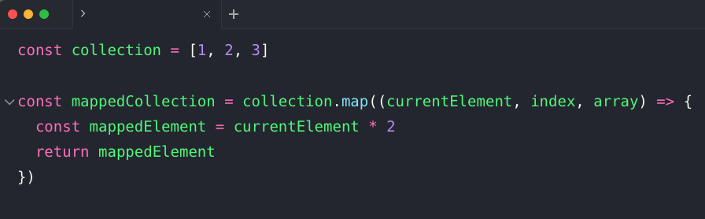

# Array.prototype.map

## Description

The `map()` method creates a new array populated with the results of calling a provided function on every element in the calling array.

## Signature

### Parameters

- callbackFn: `(element, index, array) => {//...}`
- thisArg: A value to use as this when executing `callbackFn` | (optional)

### Return

- A **new array** with each element being the result of the callback function.

## Docs source

- https://developer.mozilla.org/en-US/docs/Web/JavaScript/Reference/Global_Objects/Array/map
